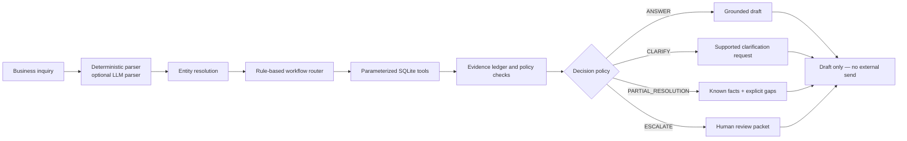

# Cross-border Payment Inquiry Agent

[](https://www.python.org/)
[](https://streamlit.io/)
[](https://www.sqlite.org/)
[](https://github.com/TongweiXU-Alice/cross-border-payment-inquiry-agent/actions/workflows/quality.yml)

An auditable inquiry workflow for synthetic cross-border payment cases. It resolves a transaction, queries local SQLite tools, checks whether the evidence supports each requested conclusion, drafts a response, and flags cases that need human follow-up.

> [!IMPORTANT]
> This is a portfolio demonstration, not a banking product. Every transaction, customer ID, status, SOP rule, inquiry, and document record is synthetic. The repository has no connection to a bank, SWIFT/GPI network, payment processor, or production customer system. It does not send messages or execute payments.

## 60-second demo

1. Start the Streamlit app and choose **Status conflict**.
2. Run the inquiry for `FL260024`.
3. Observe the two conflicting local records: the synthetic internal status is `PROCESSING`, while the synthetic bank-status table says `COMPLETED`.
4. The workflow returns `ESCALATE`, explains why it cannot choose a source, and creates a review packet. No external action is taken.

## Why this project

Cross-border payment inquiries often require more than a single status lookup. A reviewer may need to locate an incomplete transaction reference, follow a refund into a related payout, separate a verified fee from an unexplained amount difference, or stop when two sources disagree.

This project demonstrates that control flow with a deliberately small, inspectable stack:

- Python for parsing, orchestration, calculations, and policy checks;
- parameterized SQL over a local SQLite database;
- a Streamlit interface for scenarios, evidence, trace, and review state;
- an Excel workbook as the versioned synthetic dataset and evaluation source.

## Scope

| Implemented | Explicitly out of scope |
| --- | --- |
| Five inquiry intents: status, fee, refund, review, document metadata | Real bank, SWIFT, GPI, payment-processor, or customer-system access |
| FL-number lookup and supported multi-field matching | Payment execution, account access, or outbound customer messages |
| Local transaction, bank-status, refund, fee, document-metadata, and SOP tools | RAG, vector search, LangGraph, MCP, or hidden external services |
| Refund-chain traversal and source-status comparison | A production risk or compliance decision engine |
| Evidence ledger, validation checks, four decision states, and a review packet | Guaranteed ETA, review cause, fee attribution, or document delivery without evidence |
| Deterministic local parsing; optional OpenAI-assisted parsing behind an explicit opt-in | Using an LLM as the source of transaction facts or monetary calculations |

## Architecture



The optional LLM path only parses language into a validated inquiry schema. Transaction facts, amount arithmetic, lookups, evidence checks, decisions, and response constraints remain deterministic.

## Representative scenarios

| Scenario | Expected decision | Safety behavior to inspect |
| --- | --- | --- |
| `FL260002` status | `ANSWER` | Reports the two local statuses without promising an ETA |
| `FL260013` received 9,950 of 10,000 USD | `PARTIAL_RESOLUTION` | Confirms a 10 USD recorded fee and leaves 40 USD unexplained |
| `FL260003` refund | `ANSWER` | Follows the synthetic refund link to related payout `FL260021` |
| Citi / 5,000 USD / 20 Sep, no FL number | `CLARIFY` | Shows three candidates and asks for the only supported discriminator: FL number |
| `FL260024` status conflict | `ESCALATE` | Displays both source values and refuses to choose one silently |
| `FL260015` review + ETA + GPI metadata | `ESCALATE` | Confirms only what exists; does not invent a review reason, ETA, or downloadable file |

## Evidence validation and human review

Every run separates four kinds of information:

1. **Verified evidence** — values returned from named local tables or deterministic calculations.
2. **Validation checks** — explicit pass/warn/fail records for unique matching, source consistency, amount reconciliation, document metadata, and answer sufficiency.
3. **Unverified or disputed claims** — customer statements that are missing support or conflict with the local synthetic evidence.
4. **Human review packet** — queue, reasons, and recommended next step. The UI can record a session-only review note, but it does not persist an approval or send a response.

The Tool Trace records step name, purpose, sanitized arguments, source, result count, outcome, and timing. It intentionally avoids dumping complete transaction rows or customer history into the trace.

## Evaluation

`evaluate.py` loads the hand-authored cases from the workbook's `Inquiries` sheet and checks decision routing, intent coverage, required trace steps, escalation routing, and forbidden phrases. A failing case returns a non-zero exit code, so the same evaluation can run in CI.

The checked-in snapshot currently passes 20/20 hand-authored scenarios across decision, intent, trace, escalation, evidence-field, forbidden-phrase, and review-gate checks. This is a synthetic scenario regression suite, not a production accuracy benchmark. See [docs/EVALUATION.md](docs/EVALUATION.md) for the methodology and limitations.

```bash
python3 -m unittest discover -s tests -v
python3 evaluate.py
```

## Run locally

Python 3.11 is used in CI.

```bash
git clone https://github.com/TongweiXU-Alice/cross-border-payment-inquiry-agent.git
cd cross-border-payment-inquiry-agent

python3 -m venv .venv
source .venv/bin/activate          # Windows: .venv\Scripts\activate
python3 -m pip install -r requirements.txt

python3 setup_db.py --force
streamlit run app.py
```

The CLI uses the same workflow:

```bash
python3 main.py
```

### Optional OpenAI-assisted parsing

The default mode is fully local and deterministic. To opt in to structured language parsing:

```bash
python3 -m pip install -r requirements-llm.txt
export OPENAI_PARSER_ENABLED=1
export OPENAI_API_KEY="..."
export OPENAI_MODEL="your-supported-model"
streamlit run app.py
```

When enabled, inquiry text is sent to the configured OpenAI API project. Use synthetic text only. If the API, SDK, schema validation, or configuration fails, the workflow records the fallback and uses the deterministic parser. The implementation follows the official [Structured Outputs guidance](https://developers.openai.com/api/docs/guides/structured-outputs).

## Repository map

```text
.
├── agent/                 # parsing, orchestration, evidence, decisions, result models
├── tools/                 # read-only SQLite access and domain tools
├── data/
│   ├── Cross_Border_Payment_Agent_V1.xlsx  # synthetic source of truth
│   └── README.md
├── docs/                  # architecture, evaluation, privacy, and project specification
├── tests/                 # unit and boundary tests using an isolated temporary database
├── app.py                 # Streamlit interface
├── main.py                # interactive CLI
├── setup_db.py            # validated, atomic workbook-to-SQLite build
└── evaluate.py            # workbook-driven regression evaluation
```

The generated `data/payments.db` is a local runtime artifact and is intentionally ignored by Git.

## Data and privacy

The names `Citi`, `SCB`, and `DB` are only synthetic labels in the demo dataset. They do not describe those institutions' real systems, rules, service levels, reason-code definitions, or operating procedures. No customer PII, credentials, bank documents, or confidential employer material is included.

Read the full [privacy and data boundary](docs/PRIVACY.md) before publishing or extending the project.

## Limitations

- The parser covers a bounded Chinese/English demo vocabulary, not unrestricted payment language.
- Multi-field lookup supports the fields documented in the UI; it is not fuzzy entity resolution.
- Status and document results come from a fixed local snapshot, not live systems.
- `available=true` in the Documents sheet means synthetic metadata exists. It does not mean a real or downloadable bank file is present.
- The review state shown in Streamlit lasts only for the current browser session.
- The evaluation cases are hand-authored and intentionally small.
